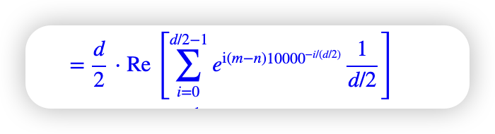

## 简介

### 为什么要位置编码

现在给一个对称的例子

有一个序列：a b c

做自注意力如果不加位置编码，其中 a对b的注意力等于b对a的注意力 a对c的注意力等于c对a的注意力

相当于使用函数f来拟合f~,a=x+p_m 和x+p_n

### 相对位置

因为我们现在要计算的是位置m和位置n的相对位置信息，所以只需要考虑 p_m^T H p_n 这一项（因为包含两个位置信息）

最开始我们先从最简单的情况开始考虑，既H等于单位矩阵I，所以上面的一项变成了 p_m^t和p_n的内积（点乘）

我们再重新考虑这个内积的意义： 既我们设计一种位置编码，当这两个位置编码做内积的时候，等于把位置m-位置n的信息带到某一个函数g里，算出相对位置信息

再换个角度想，g是一个可以算出相对位置的函数，输入为两个位置之差m-n,但是我们现在不知道这个函数具体怎么实现，但是我们可以设计一种位置编码，当这两个位置编码做内积时等于拟合这个函数g（m-n）

接下来，我们先从维度d=2的情况来考虑

现在位置向量是一个二维的，把其看做复数形式，其中第一维是实数，第二维是复数

所以p_m和p_n的内积等于p_m和p_n的共轭 相乘的实部（因为点积的话，虚数乘虚数=实数，最后推出来等于前面这样算的实部）

现在假设有一个q_m−n 等于上面的p_m和p_n的共轭 相乘

现在把p_m和p_n的共轭 转为指数形式

所以q_m−n也转为指数形式，因为上面的相等，所以q_m−n的指数形式满足上面的条件

第二个公式，代入n=0 设定ϕ0=0 是为方便后面的推导ϕm=Φm

所以ϕm−ϕn=ϕm−n  再代入n=m−1 得ϕm−ϕm−1=ϕ1 说明{ϕm}是一个等差数列 公差是ϕ1

因为ϕ0=0 ϕm−ϕm−1=ϕ1 所以通解为mϕ1,设ϕ1等于θ

所以上面的推导的思想是，先假设出存在绝对位置编码的函数p两个相乘等于相对位置编码函数q

然后q函数和p函数都是虚数函数，但是可能参数值不一样，现在就根据某些假设来用p的参数值来作为q函数的参数值，从而说明使用p函数也能实现q函数，从而说明当前p函数的参数的合理性

根据欧拉公式，把指数形式转为三角函数形式

因为内积是点乘，所以满足线性叠加性，所以更高维的偶数维位置编码，可以表示为多个二维位置编码的组合

### 远程衰减

Sinusoidal位置编码追根溯源把θ_i=10000^−2i/d  i是第i维位置的index，d是位置编码的维度

把高维度的位置编码做内积，对应的维度做点积，然后写出来就等于

把铺出来的式子写成累加，然后提取d/2出来  那么式子里面就有1/2d 然后1/2d就等于d(i/(d/2))

然后使用换元法把i/(d/2)换为t,把累加类比为积分形式.因为i的累加上界是d/2-1,下界是0，所以把这个代入到i中可以看出积分的上下界约为1到0

然后画出积分的图出来

衰减性的作用：注意力的分布i应该对长度n不敏感。更具体一点，就是如果在已有的token基础上，再补充几个token，那么新算出来各个ai,j自然也会有所改变，但我们希望i不要有太大改变。

这说明如果相对距离太大的两个位置，那么他们的内积的结果会衰减，越大的话逐渐衰减，相对位置的信息对注意力的影响越低，最坏结果为相对位置对注意力的影响几乎为0

就这样看上去，除了θt=t
比较异常之外（与横轴有交点），其他都没有什么明显的区分度，很难断定孰优孰劣，无非就是幂函数在短距离降得快一点，而指数函数则在长距离降得快一点，θt
整体越接近于0，那么整体就降得慢一些，等等。如此看来θt=10000^−t
也只是一个折中的选择，没有什么特殊性，要是笔者来选，多半会选θt=1000^−t
。还有一个方案是，直接让θi=10000^−2i/d
作为各个θi
的初始化值，然后将它设为可训练的，由模型自动完成微调，这样也不用纠结选哪个了

### 一般情况

因为H是对角矩阵，只有对角线才有值，其他为0

因为它们是成对出现的，所以累加为1到d/2

然后H的index是从0开始的,既cos第一个的位置为(0,0)，sin的第一个位置为（1,1）,所以偶数的对角位置为cos 奇数的对角位置为sin

多出m+n 这一项，如果不需要它，模型可以让H_2i,2i=H_2i+1,2i+1来消除它 

因为H是二阶梯度，如果要H_2i,2i=H_2i+1,2i+1，也只能让模型自己去更新参数，自己去实现

H的对角线占主项指的是 H矩阵中数量级大的值都在对角线上

协方差算的是相关性，值越大相关性越大

### 讨论

