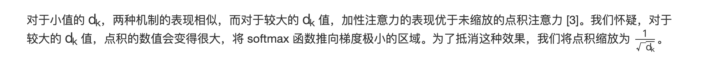
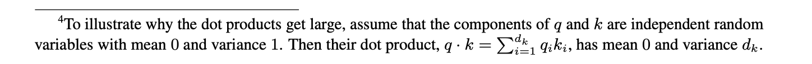

### Q:为什么在算自注意力的时候要除以根号d?

A:  在《Attention is All you need》中关于除以根号d的解释如下：


翻译过来的大概意思是：




这里想表明如果当k向量的维度太大（一般qkv向量维度都是一样的）的时候，点积注意力（注意：这个点积注意力是没有除以根号d的）效果不如加法注意力。论文对此的解释是：qk点积的数值会变得很大，将 softmax 函数推向梯度极小的区域，所以要除以根号d_k来避免。

虽然论文中有解释了，但是现在又引出第二个问题了，为什么会qk点积的数值会把softmax推向梯度极小的区域？

在论文中的注脚的地方，有关于这个解释



他的意思是q向量和k向量都是均值为0，方差为1分布的独立随机向量，所以qk向量相乘的方差为根号d.

证明如下：


所以d_k越大，会导致qk相乘的结果的方差越大。

qk相乘的结果的方差越大会怎么样？

在微信公众号：看图学大模型 中关于Attention为什么要除以根号d 的文章中做出以下的解释和实验

当qk相乘的结果方差越大，softmax 退化为 argmax,softmax 函数将会趋近于将最大的元素赋值为 1，而其他元素赋值趋近于为 0

他做出如下的实验：

```python

import numpy as np

n = 10

x1 = np.random.normal(loc=0, scale=1, size=n)
x2 = np.random.normal(loc=0, scale=np.sqrt(512), size=n)
print('x1最大值和最小值的差值:', max(x1) - min(x1))
print('x1最大值和最小值的差值:', max(x2) - min(x2))

def softmax(x):
    return np.exp(x) / np.sum(np.exp(x), keepdims=True)

def softmax_grad(y):
    return np.diag(y) - np.outer(y, y)

ex1 = softmax(x1)
ex2 = softmax(x2)
print('softmax(x1) =', ex1)

print('softmax(x2) =', ex2)


```

结果：

```python
x1最大值和最小值的差值: 1.8973472870218264
x2最大值和最小值的差值: 66.62254341144866
softmax(x1) = [0.16704083 0.21684976 0.0579299  0.05408421 0.16109133 0.14433417
 0.03252007 0.05499126 0.04213939 0.06901908]
softmax(x2) = [4.51671361e-19 2.88815837e-21 9.99999972e-01 3.02351231e-17
 3.73439970e-25 8.18066523e-13 2.78385563e-08 1.16465424e-29
 7.25661271e-20 3.21813750e-21]

```

可以看出，在方差为根号512的时候，softmax 只有第三个元素接近1，其他都几乎为0.

他们的梯度如下：

```python
max of gradiant of softmax(x1) = 0.1698259433168865

max gradiant of softmax(x2) = 2.7839373695215386e-08

```

可以看出，在方差为根号512的时候，梯度接近消失

所以除以根号dk是为把qk相乘的方差控制为1。


