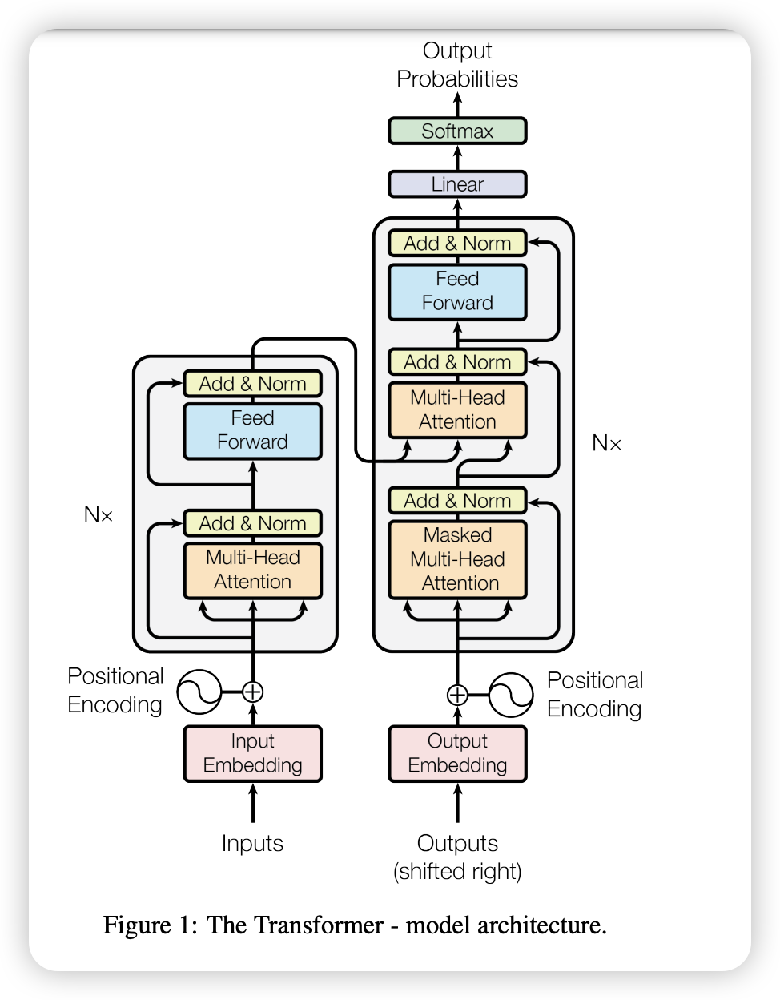
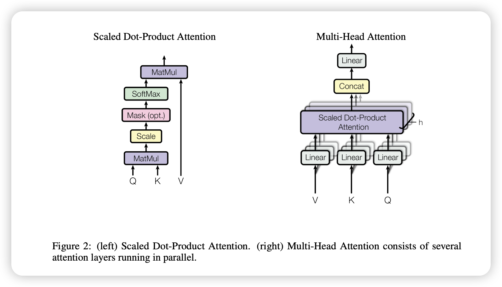
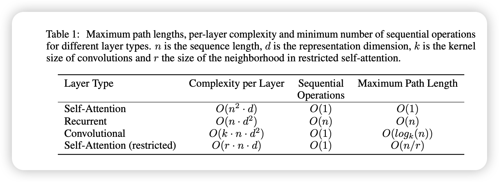
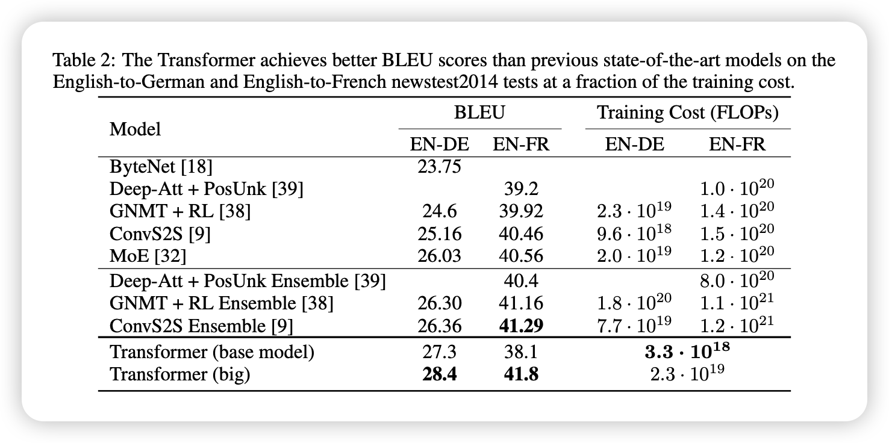
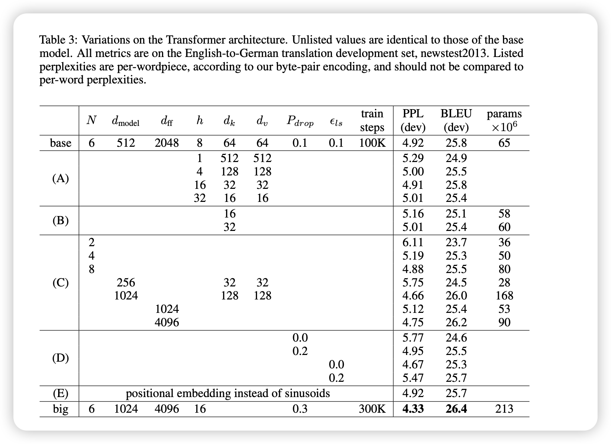
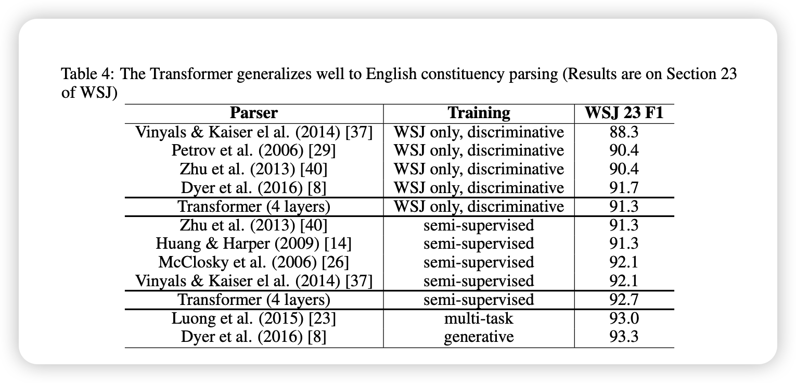

## 摘要

主流的序列处理模型基于复杂的递归神经网络或卷积神经网络，这些网络包括编码器和解码器。表现最好的模型还通过注意力机制连接编码器和解码器。我们提出了一种新的简单网络架构，即Transformer，该架构完全基于注意力机制，完全舍弃了递归和卷积。对两个机器翻译任务的实验表明，这些模型不仅在质量上更优，而且具有更高的并行性，并且需要显著更少的训练时间。我们的模型在WMT 2014英德翻译任务上达到了28.4的BLEU分数，比现有的最佳结果（包括集成模型）提高了超过2个点分数。在WMT 2014英法翻译任务上，我们的模型在八个GPU上训练3.5天后，建立了新的单模型BLEU分数的最新纪录，为41.8，只需要文献中最佳模型的一小部分训练成本。我们成功应用于英语成分解析任务，展示了Transformer在大规模和有限训练数据下的良好泛化能力。

## Introduction

递归神经网络（Recurrent Neural Networks, RNNs），尤其是长短期记忆网络（Long Short-Term Memory, LSTM）和门控递归神经网络（Gated Recurrent Neural Networks, GRNNs），已经被确立为序列建模问题（如语言建模和机器翻译）的最新方法。自此以来，许多努力继续推动递归语言模型和编码器-解码器架构的界限。

递归模型通常沿输入和输出序列的符号位置进行计算分解。将位置与计算时间步骤对齐，它们生成一系列隐藏状态 \(h_t\)，这是前一个隐藏状态 \(h_{t-1}\) 和位置 \(t\) 的输入的函数。这种固有的顺序性阻碍了训练样本内的并行化，随着序列长度的增加，这在内存限制下批处理样本时变得至关重要。最近的工作通过因子分解技巧和条件计算实现了计算效率的显著提升，同时在后者的情况下也提高了模型性能。然而，顺序计算的基本限制依然存在。

注意力机制已成为各种任务中令人信服的序列建模模型的重要组成部分，允许在输入或输出序列中的任意位置建模依赖关系。然而，除了少数几个例外，这些注意力机制通常与递归网络结合使用。

在这项工作中，我们提出了Transformer，这是一种完全舍弃递归、完全依赖注意力机制在输入和输出之间绘制全局依赖关系的模型架构。Transformer允许显著更多的并行化，并且在八个P100 GPU上训练仅十二小时后即可达到新的翻译质量的最新水平。

## Background

减少顺序计算的目标也构成了扩展神经GPU（Extended Neural GPU）、ByteNet和ConvS2S的基础，这些模型都使用卷积神经网络作为基本构建模块，并行计算所有输入和输出位置的隐藏表示。在这些模型中，关联任意输入或输出位置的信号所需的操作数量随着位置之间的距离而增长，对于ConvS2S是线性增长，对于ByteNet是对数增长。这使得学习远距离位置之间的依赖关系变得更加困难。在Transformer中，这被减少到一个常数的操作数量，尽管由于平均注意力加权位置而导致有效分辨率降低，我们通过多头注意力机制（Multi-Head Attention）来对抗这种影响，如第3.2节所述。

自注意力（Self-attention），有时也称为内注意力（Intra-attention），是一种注意力机制，用于关联单个序列的不同位置以计算序列的表示。自注意力已经成功应用于各种任务，包括阅读理解、抽象总结、文本蕴含和学习任务无关的句子表示。

端到端记忆网络（End-to-end memory networks）基于递归注意力机制而不是序列对齐的递归机制，已经证明在简单语言问答和语言建模任务中表现良好。

据我们所知，Transformer是第一个完全依赖自注意力机制来计算输入和输出表示的模型，而不使用序列对齐的RNN或卷积。在接下来的章节中，我们将描述Transformer，阐述自注意力的动机，并讨论它相对于其他模型（如上述模型）的优势。

## Model Architecture

大多数有竞争力的神经序列转导模型都采用编码器-解码器结构。在这种结构中，编码器将符号表示的输入序列 (x1, ..., xn) 映射到连续表示的序列 z = (z1, ..., zn)。在给定 z 的情况下，解码器逐个生成符号的输出序列 (y1, ..., ym)。在每一步中，模型都是自回归的，即在生成下一个token时，会将之前生成的token作为额外的输入。Transformer 采用了这种总体架构，对于编码器和解码器都使用了堆叠的自注意力机制和逐点的全连接层，如图1的左半部分和右半部分所示。

### 3.1 Encoder and Decoder Stacks

**编码器**：编码器由 N = 6 个相同的层堆叠而成。每层有两个子层。第一个子层是多头自注意力机制，第二个子层是简单的逐位置全连接前馈网络。我们在每个子层周围使用了残差连接【11】，随后进行层归一化【1】。也就是说，每个子层的输出是 LayerNorm(x + Sublayer(x))，其中 Sublayer(x) 是子层本身实现的函数。为了便于这些残差连接，模型中的所有子层以及嵌入层的输出维度都是 dmodel = 512。

**解码器**：解码器也由 N = 6 个相同的层堆叠而成。除了每个编码器层中的两个子层外，解码器还插入了第三个子层，该子层基于编码器的输出上执行多头注意力机制。与编码器类似，我们在每个子层周围使用了残差连接，随后进行层归一化。我们还修改了解码器堆栈中的自注意力子层，以防止位置 i 关注到后续位置。这种掩蔽机制，加上输出嵌入的偏移一个位置，确保位置 i 的预测只能依赖于位置小于 i 的已知输出。

### 3.2 Attention

注意力函数可以描述为将查询（query）和一组键-值对映射到一个输出，其中查询、键、值和输出都是向量。输出是值的加权和，每个值的权重是通过查询与对应键的兼容性函数计算得到的。

#### 3.2.1 Scaled Dot-Product Attention

我们称我们的特定注意力机制为“缩放点积注意力”（如图2所示）。输入由维度为 \(d_k\) 的查询和键，以及维度为 \(d_v\) 的值组成。我们计算查询与所有键的点积，每个点积除以 \(\sqrt{d_k}\)，然后应用softmax函数来获得值的权重。

“在实际操作中，我们对一组查询同时计算注意力函数，将它们打包成矩阵Q。键和值也被打包成矩阵K和V。我们计算输出矩阵如下：

\[ \text{Attention}(Q, K, V) = \text{softmax}\left(\frac{QK^T}{\sqrt{d_k}}\right)V \]

两种最常用的注意力函数是加性注意力 [2] 和点积（乘法）注意力。点积注意力与我们的算法相同，只是多了一个缩放因子 \( \frac{1}{\sqrt{d_k}} \)。加性注意力使用带有一个隐藏层的前馈网络来计算兼容性函数。虽然两者在理论复杂度上相似，但在实际应用中，点积注意力更快且更节省空间，因为它可以使用高度优化的矩阵乘法代码来实现。

对于小值的 \( d_k \)，两种机制的表现相似，而对于较大的 \( d_k \) 值，加性注意力的表现优于未缩放的点积注意力 [3]。我们怀疑，对于较大的 \( d_k \) 值，点积的数值会变得很大，将 softmax 函数推向梯度极小的区域。为了抵消这种效果，我们将点积缩放为 \( \frac{1}{\sqrt{d_k}} \)。

#### 3.2.2 Multi-Head Attention

我们发现，与使用 \(d_{\text{model}}\) 维度的键、值和查询执行单一注意力函数相比，通过不同的学习到的线性投影将查询、键和值分别线性投影到 \(d_k\)、\(d_k\) 和 \(d_v\) 维度，并进行 \(h\) 次，这样做更有益。然后我们在这些投影后的查询、键和值上并行执行注意力函数，生成 \(d_v\) 维度的输出值。将这些输出值拼接后，再次投影，得到最终的值，如图2所示。”

多头注意力机制允许模型在不同位置的不同表示子空间中同时关注信息。使用单个注意力头时，平均处理会抑制这一点。

\[ \text{MultiHead}(Q, K, V) = \text{Concat}(\text{head}_1, ..., \text{head}_h)W^O \]

其中，

\[ \text{head}_i = \text{Attention}(QW^Q_i, KW^K_i, VW^V_i) \]

投影的参数矩阵为 \( W^Q_i \in \mathbb{R}^{d_{\text{model}} \times d_k} \)、\( W^K_i \in \mathbb{R}^{d_{\text{model}} \times d_k} \)、\( W^V_i \in \mathbb{R}^{d_{\text{model}} \times d_v} \) 和 \( W^O \in \mathbb{R}^{hd_v \times d_{\text{model}}} \)。

在本工作中，我们使用 \( h = 8 \) 个并行的注意力层或头。对于每个头，我们使用 \( d_k = d_v = d_{\text{model}}/h = 64 \)。由于每个头的维度减少，总的计算成本与全维度的单头注意力相似。

#### 3.2.3 Applications of Attention in our Model

“Transformer 使用了三种不同的多头注意力机制：

- 在 '编码器-解码器注意力' 层中，查询来自上一层解码器，而键和值来自编码器的输出。这允许解码器中的每个位置都可以关注输入序列中的所有位置。这模仿了典型的sequence2sequence模型中的编码器-解码器注意力机制，如 [38, 2, 9]。
- 编码器包含自注意力层。在自注意力层中，所有的键、值和查询都来自同一个地方，在这种情况下，来自编码器中上一层的输出。编码器中的每个位置都可以关注编码器中上一层的所有位置。
- 同样，解码器中的自注意力层允许解码器中的每个位置关注解码器中该位置及其之前的所有位置。我们需要防止解码器中的信息向左流动以保持自回归属性。我们通过在缩放点积注意力中屏蔽（设置为−∞） softmax 输入中对应于非法连接的所有值来实现这一点。见图 2。

### 3.3 Position-wise Feed-Forward Networks

除了注意力子层外，我们的编码器和解码器中的每一层还包含一个全连接的前馈神经网络，它分别且一致地应用于每个位置。这个网络由两个线性变换组成，中间有一个 ReLU 激活函数。
FFN(x) = max(0, xW1 + b1)W2 + b2
虽然线性变换在不同位置之间是相同的，但它们在不同层次使用不同的参数。另一种描述方式是，将其视为两个卷积核大小为 1 的卷积操作。
输入和输出的维度为 \( d_{\text{model}} = 512 \)，而内部层的维度为 \( d_{f f} = 2048 \)。

### 3.4 Embeddings and Softmax

与其他序列转换模型类似，我们使用学习嵌入将输入令牌和输出令牌转换为维度为 \( d_{\text{model}} \) 的向量。我们还使用常规的学习线性变换和 softmax 函数将解码器输出转换为预测的下一个令牌的概率。在我们的模型中，我们在两个嵌入层和 pre-softmax 线性变换之间共享相同的权重矩阵，类似于 [30]。在嵌入层中，我们将这些权重乘以 \( \sqrt{d_{\text{model}}} \)。

### 3.5 Positional Encoding

由于我们的模型不包含递归和卷积，为了使模型能够利用序列的顺序，我们必须注入一些关于序列中令牌相对或绝对位置的信息。为此，我们在编码器和解码器堆栈的底部将‘位置编码’添加到输入嵌入中。位置编码与嵌入具有相同的维度 \(d_{\text{model}}\)，以便二者可以相加。有许多位置编码的选择，包括学习的和固定的 [9]。

在这项工作中，我们使用不同频率的正弦和余弦函数：
 PE(pos, 2i) = \sin\left(\frac{pos}{10000^{2i/d_{\text{model}}}}\right) 

PE(pos, 2i+1) = \cos\left(\frac{pos}{10000^{2i/d_{\text{model}}}}\right) 
其中，pos 是位置，i 是维度。也就是说，位置编码的每个维度对应一个正弦波。波长从 \(2\pi\) 到 \(10000 \cdot 2\pi\) 形成几何级数。我们选择这个函数是因为我们假设它可以使模型容易地通过相对位置学习关注，因为对于任何固定的偏移 \(k\)， \(P E_{pos+k}\) 可以表示为 \(P E_{pos}\) 的线性函数。我们还尝试使用学习的位置嵌入 [9]，发现这两种版本产生的结果几乎相同（见表3第（E）行）。我们选择正弦版本，因为它可能允许模型外推到训练期间遇到的序列长度更长的情况。”

## 4 Why Self-Attention

在本节中，我们将自注意力层与通常用于将一个可变长度的符号表示序列 (x1, ..., xn) 映射到另一个相同长度序列 (z1, ..., zn) 的递归和卷积层的各个方面进行比较，其中 xi 和 zi ∈ R^d，例如典型序列转换编码器或解码器中的隐藏层。为了激励我们使用自注意力，我们考虑了三个需求。

一是每层的总计算复杂度。另一个是可以并行化的计算量，以所需的最少顺序操作数来衡量。第三个是网络中长程依赖的路径长度。在许多序列转换任务中，学习长依赖是一项关键挑战。影响学习这种依赖能力的一个关键因素是网络中前向和后向信号必须经过的路径长度。输入和输出序列中任何位置组合之间的这些路径越短，学习长依赖就越容易【12】。因此，我们还比较了由不同层类型组成的网络中任何两个输入和输出位置之间的最大路径长度。

如表1所示，自注意力层以常数数量的顺序操作所有位置，而递归层需要 O(n) 个顺序操作。在计算复杂度方面，当序列长度 n 小于表示维度 d 时，自注意力层比递归层更快，这在最先进的机器翻译模型中使用的句子表示（如 word-piece【38】和 byte-pair【31】表示）中最常见。为了提高处理非常长序列任务的计算性能，可以将自注意力限制为只考虑以相应输出位置为中心的输入序列大小为 r 的邻域。这将使最大路径长度增加到 O(n/r)。我们计划在未来的工作中进一步研究这种方法。

单个卷积层（核宽度 k < n）不能连接所有输入和输出位置对。实现这一点需要 O(n/k) 个卷积层的堆叠（对于连续内核）或 O(logk(n)) 的扩展卷积【18】，从而增加网络中任意两个位置之间最长路径的长度。卷积层通常比递归层更昂贵，费用为 k 的倍数。然而，可分离卷积【6】大大降低了复杂度，降至 O(k · n · d + n · d^2)。即使 k = n，分离卷积的复杂度也等于我们模型中使用的自注意力层和逐点前馈层的组合。

一个附带好处是，自注意力可能会产生更具可解释性的模型。我们检查了模型中的注意力分布，并在附录中展示和讨论了例子。各个注意力头不仅明显学习执行不同的任务，许多还显示出与句子语法和语义结构相关的行为。

## 5 Training

### 5.1 Training Data and Batching
我们在标准的 WMT 2014 英德数据集上进行了训练，该数据集包含大约 450 万对句子。句子使用字节对编码（byte-pair encoding）[3] 进行编码，输入和输出共享一个大约 37000 个标记的词汇表。对于英法语，我们使用了更大的 WMT 2014 英法数据集，该数据集包含 3600 万个句子，并将token拆分为 32000 个词片（word-piece）词汇表 [38]。句子对按照大致的序列长度进行分组。每个训练批次包含一组句子对，约有 25000 个输入token和 25000 个目标token。

### 5.2 Hardware and Schedule

我们在一台配备 8 个 NVIDIA P100 GPU 的机器上训练了我们的模型。对于使用本文所述超参数的基础模型，每一步训练大约需要 0.4 秒。我们总共训练了 100,000 步或 12 小时。对于大型模型（表 3 底部所描述的），每步训练时间为 1.0 秒。大型模型训练了 300,000 步（3.5 天）。

我们使用了 Adam 优化器 [20]，设置 β1 = 0.9，β2 = 0.98 和 ϵ = 10−9。我们在训练过程中根据以下公式调整学习率：

\[ lrate = d^{-0.5}_{model} \cdot \min(\text{step\_num}^{-0.5}, \text{step\_num} \cdot \text{warmup\_steps}^{-1.5}) \]

这意味着在前 warmup\_steps 步训练中线性增加学习率，之后按步数的平方根倒数成比例地减少学习率。我们使用的 warmup\_steps = 4000。

### Residual Dropout

我们在每个子层的输出上应用 dropout [33]，在将其添加到子层输入并进行归一化之前。此外，我们还对编码器和解码器堆栈中嵌入和位置编码的和应用 dropout。对于基础模型，我们使用的 dropout 率为 Pdrop = 0.1。

### Label Smoothing

在训练过程中，我们采用了值为 ϵls = 0.1 的标签平滑 [36]。这会增加困惑度，因为模型会学得更加不确定，但会提高准确性和 BLEU 分数。

## 6 Results

### 6.1 Machine Translation

在 WMT 2014 英语-德语翻译任务中，大型 Transformer 模型（表 2 中的 Transformer (big)）比之前报告的最优模型（包括集成模型）高出 2.0 多个 BLEU 分数，建立了新的最先进 BLEU 分数记录 28.4。该模型的配置列在表 3 的底行。训练在 8 个 P100 GPU 上进行了 3.5 天。即使是我们的基本模型，也超过了所有先前发布的模型和集成模型，而且训练成本仅为任何竞争模型的一小部分。

在 WMT 2014 英语-法语翻译任务中，我们的大型模型实现了 41.0 的 BLEU 分数，超过了所有先前发布的单一模型，训练成本不到之前最先进模型的四分之一。用于英语-法语的大型 Transformer 模型在训练中使用的 dropout 率为 Pdrop = 0.1，而不是 0.3。

对于基本模型，我们使用了通过平均最后 5 个检查点得到的单一模型，这些检查点是在 10 分钟间隔内写入的。对于大型模型，我们平均了最后 20 个检查点。我们使用 beam search，beam size 为 4，长度惩罚 α = 0.6 [38]。这些超参数是在开发集上进行实验后选择的。我们在推理过程中将最大输出长度设置为输入长度 + 50，但尽可能提前终止 [38]。

表 2 总结了我们的结果，并将我们的翻译质量和训练成本与文献中的其他模型架构进行了比较。我们通过乘以训练时间、使用的 GPU 数量和每个 GPU 的单精度浮点容量估算来估计训练模型所使用的浮点操作数。

### 6.2  Model Variations

为了评估 Transformer 不同组件的重要性，我们以不同的方式调整了我们的基础模型，测量了这些变化对开发集（newstest2013）上英语-德语翻译性能的影响。我们使用了上一节描述的 beam search，但没有进行检查点平均。我们将这些结果呈现在表 3 中。

在表 3 的 (A) 行中，我们在保持计算量恒定的情况下，改变了注意力头的数量以及注意力键和值的维度，如第 3.2.2 节所述。虽然单头注意力比最佳设置差 0.9 BLEU 分数，但头数过多也会导致质量下降。

在表 3 的 (B) 行中，我们观察到减少注意力键大小 dk 会损害模型质量。这表明确定兼容性并不容易，更复杂的兼容性函数可能比点积更有利。我们进一步在 (C) 和 (D) 行中观察到，正如预期的那样，模型越大效果越好，并且 dropout 对于避免过拟合非常有帮助。在 (E) 行中，我们将正弦位置编码替换为学习的位置嵌入 [9]，结果与基础模型几乎相同。

### 6.3 English Constituency Parsing

为了评估 Transformer 是否能够推广到其他任务，我们对英语成分解析进行了实验。该任务提出了特定的挑战：输出受强烈的结构约束并且明显长于输入。此外，在小数据环境中，RNN 序列到序列模型未能取得最新的最优结果 [37]。

我们在 Penn Treebank [25] 的 Wall Street Journal (WSJ) 部分上训练了一个 4 层的 Transformer，dmodel = 1024，大约 4 万个训练句子。我们还在半监督环境中训练了它，使用了高置信度和 BerkleyParser 语料库的大型数据集，约 1700 万句子 [37]。在仅使用 WSJ 数据集的情况下，我们使用了 16K 词汇表，在半监督设置下使用了 32K 词汇表。

我们只进行了少量实验来选择 dropout（包括注意力和残差层，第 5.4 节）、学习率和 beam size，这些实验是在第 22 节的开发集上进行的，所有其他参数都保持不变，和英语到德语的基础翻译模型一致。在推断期间，我们将最大输出长度增加到输入长度 + 300。我们在 WSJ 仅用和半监督环境中都使用了 21 的 beam size 和 α = 0.3。

我们的结果如表 4 所示，尽管缺乏特定任务的调整，我们的模型表现出令人惊讶的良好效果，结果比以前报告的所有模型都好，除了 Recurrent Neural Network Grammar [8]。

与 RNN 序列到序列模型 [37] 相比，Transformer 即使仅在包含 4 万句子的 WSJ 训练集上训练，也超过了 BerkeleyParser [29]。

## 7 Conclusion

在这项工作中，我们提出了 Transformer，这是一种完全基于注意力的序列转换模型，用多头自注意力取代了编码器-解码器架构中最常用的递归层。

对于翻译任务，Transformer 的训练速度明显快于基于递归或卷积层的架构。在 WMT 2014 英语到德语和 WMT 2014 英语到法语翻译任务中，我们都实现了新的最优结果。在前一个任务中，我们的最佳模型甚至超过了所有先前报告的集成模型。

我们对注意力模型的未来感到兴奋，并计划将其应用于其他任务。我们计划将 Transformer 扩展到涉及文本以外的输入和输出模式的问题，并研究局部、受限的注意力机制，以有效处理大规模输入和输出，如图像、音频和视频。使生成过程更少依赖于顺序性是我们的另一个研究目标。

